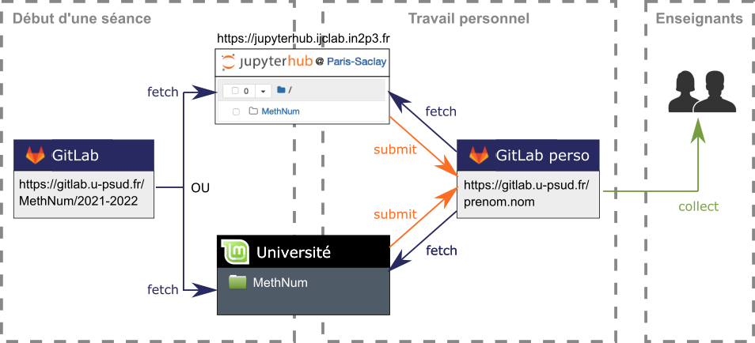
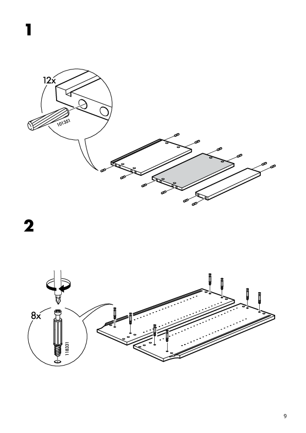
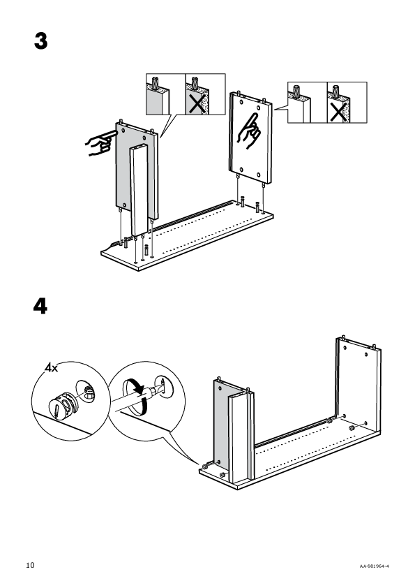
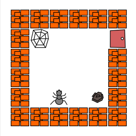

---
jupytext:
  notebook_metadata_filter: rise
  text_representation:
    extension: .md
    format_name: myst
    format_version: 0.13
    jupytext_version: 1.14.0
kernelspec:
  display_name: C++17
  language: C++17
  name: xcpp17
rise:
  auto_select: first
  autolaunch: false
  centered: false
  controls: false
  enable_chalkboard: true
  height: 100%
  margin: 0
  maxScale: 1
  minScale: 1
  scroll: true
  slideNumber: true
  start_slideshow_at: selected
  transition: none
  width: 90%
---

+++ {"editable": true, "slideshow": {"slide_type": ""}}

# Programmation impérative (Info 111)

Nicolas Thiéry

<http://Nicolas.Thiery.name/Enseignement/Info111>

+++ {"slideshow": {"slide_type": "slide"}}

## Pourquoi enseigner l'informatique?

+++ {"slideshow": {"slide_type": "fragment"}}

:::{admonition} Évidence : l'ordinateur est partout!

-   Combien d'ordinateurs dans la salle?
-   Combien d'ordinateurs possédez vous?
-   Le mot « assisté par ordinateur » a disparu
-   Usage constant des ordinateurs, pour le travail comme le reste

:::

+++ {"slideshow": {"slide_type": "fragment"}}

:::{admonition} Évidence : tous les jeunes connaissent déjà l'informatique!

.

:::

+++ {"slideshow": {"slide_type": "fragment"}}

**<div style="color: red; text-align: center;">Vraiment?</div>**

+++ {"slideshow": {"slide_type": "slide"}}

### C'est quoi l'informatique en fait?

<!-- multi-cell admonition? -->

**Une petite analogie :**

-   M. Einstein, vous qui êtes un excellent **physicien**,
    vous devez savoir changer la roue de ma voiture, non?

+++ {"slideshow": {"slide_type": "fragment"}}

-   M. Alonso, vous qui êtes un excellent **conducteur** de F1,
    vous devez savoir réparer le carburateur de ma voiture, non?

+++ {"slideshow": {"slide_type": "fragment"}}

**<div style="color: red; text-align: center;">Conducteur $\ne$ Garagiste $\ne$ Physicien</div>**

+++ {"slideshow": {"slide_type": "fragment"}}

Et pourtant, loin d'être Einstein ou Alonso, ...

-   M. Thiéry, vous qui êtes **professeur en informatique**,
    vous devez savoir réparer mon W.....s, non?

+++ {"slideshow": {"slide_type": "slide"}}

### C'est quoi l'informatique en fait?

:::{admonition} Suite de la petite analogie

| L'usage           | La technologie              | La science         |
| ----------------- | --------------------------- | ------------------ |
| Conduite          | Réparation, Conception      | Physique           |
| Consommation      | Cuisine                     | Chimie, Biologie   |
| Utilisation       | Programmation, ...          | Informatique       |

:::

+++ {"slideshow": {"slide_type": "slide"}}

### Qu'est-ce qu'on apprend à l'école?

+++ {"slideshow": {"slide_type": "fragment"}}

-   Principalement **la science**

+++ {"slideshow": {"slide_type": "fragment"}}

-   Et il y a des raisons profondes pour cela

    :::{image} media/Vinci.jpg
    :width: 60%
    :alt: "Ceux qui sont férus de pratique sans posséder la science sont comme le pilote qui s'embarquerait sans timon ni boussole et ne saurait jamais vraiment où il va -- Léonard de Vinci"
    :::

+++ {"slideshow": {"slide_type": "fragment"}}

-   Et des pressions pour que ce ne soit pas le cas

+++ {"slideshow": {"slide_type": "fragment"}}

<!-- TODO IMG -->

::::{grid}

:::{grid-item-card}
**[Quelle école pour la société de
l'information?](http://www.framablog.org/index.php/post/2013/06/11/francois-elie-education-conference)**

Une conférence de [François Élie](http://fr.wikipedia.org/wiki/Fran%C3%A7ois_Elie)

À lire ou écouter ... et méditer ...
:::

:::{grid-item-card}

:::
::::

+++ {"slideshow": {"slide_type": "subslide"}}

### Tous les jeunes connaissent déjà l'informatique?

+++ {"slideshow": {"slide_type": "fragment"}}

**L'usage?**

+++ {"slideshow": {"slide_type": "fragment"}}

-   Évidence : tous les jeunes savent utiliser un ordinateur

+++ {"slideshow": {"slide_type": "fragment"}}

-   Vraiment?
    [les-enfants-ne-savent-pas-se-servir-dun-ordinateur](http://nicolaslegland.wordpress.com/2013/08/15/les-enfants-ne-savent-pas-se-servir-dun-ordinateur/)

+++ {"slideshow": {"slide_type": "fragment"}}

**La technologie?**

-   Qui sait programmer? Configurer un réseau?

+++ {"slideshow": {"slide_type": "fragment"}}

**La science?**

+++ {"slideshow": {"slide_type": "fragment"}}

**Ma petite expérience :**

-   6ème :
    ```{image} media/Epson-hx-20.jpg
    :alt: Ordinateur portable Epson HX-20
    :height: 100px
    :align: center
    ```
    3ème:
    ```{image} media/TurboPascal-Objet.jpg
    :alt: Manuel Turbo Pascal Objet
    :height: 100px
    :align: center
    ```

+++ {"slideshow": {"slide_type": "fragment"}}

-   Fac : apprendre la *science* a chamboulé ma programmation

+++ {"slideshow": {"slide_type": "fragment"}}

-   2023 : après 33 ans et 300000 lignes de code, j'apprends encore ...

+++ {"slideshow": {"slide_type": "slide"}}

## La science informatique?

+++ {"slideshow": {"slide_type": "fragment"}}

:::{prf:definition}

L'***informatique*** est la Science du calcul et de l'information

:::

+++ {"slideshow": {"slide_type": "fragment"}}

:::{admonition} Thème fondamental : étude des systèmes en évolution

-   État du système avant
-   Étape de calcul
-   État du système après

:::

+++ {"slideshow": {"slide_type": "slide"}}

### Grands thèmes de l'informatique

:::{admonition} Calculabilité : Que peut, ou ne peut pas faire, un ordinateur?

-   Modèles de calcul
-   Indépendamment du langage
-   Indépendamment du matériel
-   Miracle : tous les langages sont équivalents!
:::

+++

:::{admonition} Complexité : Combien faut-il de ressources pour résoudre un problème?

-   Indépendamment du langage
-   Indépendamment du matériel
-   Indépendamment de l'algorithme?
:::

+++ {"slideshow": {"slide_type": "subslide"}}

### Grands thèmes de l'informatique (suite)

:::{admonition} Maîtriser les systèmes extrêmement complexes

-   Internet avec des milliards d'ordinateurs
-   Programmes avec des millions de lignes
-   Données occupant des petaoctets ($10^{15}$ octets!)
-   Services gérant des millions de clients
:::

+++ {"slideshow": {"slide_type": "fragment"}}

Problématiques de **passage à l'échelle**

+++ {"slideshow": {"slide_type": "fragment"}}

Stratégies d'**abstraction**

Exemple : Couches OSI pour les réseaux

+++ {"slideshow": {"slide_type": "fragment"}}

:::{admonition} Difficulté
:class: attention

Apprendre des outils conçus pour les programmes de 100000 lignes

en travaillant sur des programmes de 10 lignes ...
:::

+++ {"slideshow": {"slide_type": "subslide"}}

### Grands thèmes de l'informatique (suite)

+++ {"slideshow": {"slide_type": "fragment"}}

**Comment mieux s'exprimer pour que l'ordinateur résolve nos
problèmes?**

:::{admonition} Conceptions des **langages de programmation**

-   Java, C++, Python, Ada, Pascal, Perl, Camel, Haskell, Go, Rust...
-   Un nouveau langage par semaine depuis 50 ans!

<!-- couper ici!!! -->

-   Heureusement les **concepts** sont presque toujours les mêmes :

    -   Programmation impérative
    -   Programmation objet
    -   Programmation fonctionnelle
    -   Programmation logique
    -   Orchestration de flots de données
    -   Apprentissage
    -   Algorithmique et structures de données
    -   ...

-   Au delà des langages: modélisation, ...
:::

+++ {"slideshow": {"slide_type": "subslide"}}

### Grands thèmes de l'informatique (suite)

-   Interactions Humain Machine
-   Bases de données
-   Modèles et structures de données
-   Architecture des ordinateurs, parallélisme
-   Réseaux, transmission de données
-   Sureté et sécurité du logiciel :  
    spécification, test, preuve
-   Sureté et sécurité des données :  
    codage, cryptographie
-   Langages formels, automates, compilation
-   Mathématiques discrètes : graphes, combinatoire, ...

+++ {"slideshow": {"slide_type": "slide"}}

## À propos de ce cours

:::{admonition} Au programme
-   **Science** : concepts de la programmation structurée
-   **Technologie** : programmation C++ (simple)
-   **Usage** : environnement de programmation, GNU/Linux
:::

+++ {"slideshow": {"slide_type": "fragment"}}

:::{admonition} Ce que l'on va voir
-   Des briques de bases, des règles de compositions
-   Les constructions usuelles
-   Les problèmes déjà résolus, les erreurs les plus courantes

:::

+++ {"slideshow": {"slide_type": "fragment"}}

:::{hint} Pour quoi faire??
-   Bénéficier de l'expérience de plus de 50 ans de programmation
-   Intuition de ce qui est possible ... ou pas
-   Intuition de comment résoudre un nouveau problème
:::

+++ {"slideshow": {"slide_type": "subslide"}}

### Organisation du cours

1h30 amphi, 1h30 TD, 2h TP

+++ {"slideshow": {"slide_type": "fragment"}}

:::{hint} Du TD? pour quoi faire???
-   Apprendre la science informatique, en utilisant un ordinateur, pour
    programmer ...
-   Comme apprendre la physique, au volant d'une voiture ...
-   C'est pas facile ...
:::

+++ {"slideshow": {"slide_type": "fragment"}}

:::{admonition} Une difficulté : la forte hétérogénéité de niveau
:class: attention
Ce module s'adresse à tous, *débutants* comme *expérimentés*
:::

+++ {"slideshow": {"slide_type": "fragment"}}

:::{important} Évaluation
-   25% : Examen mi-semestre (dans l'axe des TD)
-   40% : Examen final (vision d'ensemble)
-   20% : Projet en fin de semestre
-   15% : Exercices en ligne, notes de TP
:::

+++ {"editable": true, "slideshow": {"slide_type": "subslide"}}

### Comment travailler l'informatique?

+++ {"editable": true, "jp-MarkdownHeadingCollapsed": true, "slideshow": {"slide_type": "fragment"}}

-   Parcourir le cours (poly ou page web) avant l'amphi  
    15 min perso / semaine
-   Participer activement en amphi : questions, prise de notes
-   Travailler le poly et vos notes; apprendre les définitions  
    15 min perso / semaine ?

+++ {"editable": true, "jp-MarkdownHeadingCollapsed": true, "slideshow": {"slide_type": "fragment"}}

-   Commencer les exercices de TD avant la séance  
    Participer activement en TD  
    «Finir» pour la semaine suivante  
    1h perso / semaine?
-   Participer activement en TP  
    «Finir» les exercices de TP pour la semaine suivante  
    2h / semaine?
-   Projet de fin de semestre  
    30h

+++ {"editable": true, "jp-MarkdownHeadingCollapsed": true, "slideshow": {"slide_type": "fragment"}}

-   Il vous faut un ordinateur ou tablette avec un navigateur web!  
    Variante: salle informatique en libre service

+++ {"editable": true, "slideshow": {"slide_type": "subslide"}}

### Fraude et plagiat

+++ {"editable": true, "slideshow": {"slide_type": "fragment"}}

:::{hint} S'entraider (explications, aide au débogage, ...)
C'est super!
:::

+++ {"editable": true, "slideshow": {"slide_type": "fragment"}}

:::{attention} Récupérer du code de quelqu'un d'autre (dont IA générationnelles comme chat-GPT)
**À ce stade, c'est contre-productif**
:::

+++ {"editable": true, "slideshow": {"slide_type": "fragment"}}

:::{danger} Sans le dire
C'est de la **fraude**
:::

+++ {"editable": true, "slideshow": {"slide_type": "fragment"}}

:::{important} Vous êtes de futurs scientifiques
-   L'intégrité est une valeur essentielle en science
-   Nous vous faisons confiance
:::

+++ {"editable": true, "slideshow": {"slide_type": "fragment"}}

:::{warning} Mais, au cas où, nous avons quelques outils :-)

<!-- asdfsdf -->
:::

+++ {"editable": true, "slideshow": {"slide_type": "subslide"}}

### Infrastructure du cours

+++ {"editable": true, "slideshow": {"slide_type": "fragment"}}

Suivez le guide!

+++ {"editable": true, "slideshow": {"slide_type": "fragment"}}

:::{admonition} Espace eCampus
-   Pour interagir avec les enseignants
-   <https://ecampus.paris-saclay.fr/course/view.php?id=80953>
:::

+++ {"editable": true, "slideshow": {"slide_type": "fragment"}}

:::{admonition} Page web
-   Pour trouver toutes les informations
-   <http://nicolas.thiery.name/Enseignement/Info111/>  
-   Mot clés: «Info111» ou «Nicolas Thiéry»
:::

+++ {"editable": true, "slideshow": {"slide_type": "subslide"}}

### Infrastructure du cours, suite

+++ {"editable": true, "slideshow": {"slide_type": "fragment"}}

:::{admonition} Salles de TP
-   Pour programmer
-   Salle de TP physique à la fac au 336 (SIF / PGIP)
-   Salle de TP virtuelle [JupyterHub@Paris-Saclay](https://jupyterhub.ijclab.in2p3.fr/) 
    ```{image} media/logo-jupyterhub.svg
    :alt: logo jupyterhub
    :height: 20px
    :align: center
    ```
    <!-- <https://jupyterhub.ijclab.in2p3.fr/> -->
-   Ou directement sur votre machine personnelle
-   Exercices en ligne PLaTon

:::

+++ {"editable": true, "slideshow": {"slide_type": "fragment"}}

:::{admonition} Forge logicielle GitLab

```{image} media/logo-gitlab.svg
:alt: logo gitlab
:width: 5%
:float: right
```

-   Pour héberger vos devoirs
-   <https://gitlab.dsi.universite-paris-saclay.fr/>
:::

+++ {"editable": true, "slideshow": {"slide_type": "subslide"}}

:::{admonition} Gestion des devoirs avec GitLab et travo


Une innovation pédagogique Orsay / Montréal!
:::

+++ {"slideshow": {"slide_type": "slide"}}

## Ordinateurs et traitement automatique des informations

+++ {"slideshow": {"slide_type": "fragment"}}

**Exemples d'ordinateurs :**

+++ {"slideshow": {"slide_type": "fragment"}}

-   Calculatrice (programmable)
-   Ordinateur personnel (PC, Mac, ...)
-   Station de travail (Sun, DEC, HP, ...)
-   Super-ordinateur (Cray, IBM-SP, ...)
-   Clusters d'ordinateurs

+++ {"slideshow": {"slide_type": "fragment"}}

**Mais aussi :**

-   Puce (programme fixe)
-   Tablettes
-   Téléphones portables, appareils photos, GPS, lecteurs MP3, ...
-   Box, routeurs wifi, ...
-   Téléviseurs, ...
-   Arduino, Raspberry Pi, ...

+++ {"slideshow": {"slide_type": "slide"}}

### Caractéristiques principales d'un ordinateur

+++ {"slideshow": {"slide_type": "fragment"}}

:::{admonition} Absolument stupide
:class: warning
-   Il obéit strictement aux ordres reçus
-   Fiable? Est-ce qu'il fait ce que l'on veut?
:::

+++ {"slideshow": {"slide_type": "fragment"}}

:::{admonition} Très très rapide
:class: hint
-   2GHz : 2 milliards d'opérations par seconde
-   sans faire d'erreur
:::

+++ {"slideshow": {"slide_type": "fragment"}}

:::{admonition} Très très bonne mémoire
:class: hint
-   Bible : Mo (million de caractères)
-   Mémoire : Go (milliards de caractères)
-   Disque : To (1000 milliards de caractères)
-   Data center : Po
:::

+++ {"slideshow": {"slide_type": "subslide"}}

### À quoi sert un ordinateur?

+++ {"slideshow": {"slide_type": "fragment"}}

**Stocker des informations :**

-   Documents, musique, photos, agenda, ...

+++ {"slideshow": {"slide_type": "fragment"}}

**Traiter automatiquement des informations :**

-   ***Entrée***: informations venant du clavier, de la
    souris, de capteurs, de la mémoire, d'autres ordinateurs, ...

-   Traitement des informations en exécutant un ***programme***

-   ***Sortie***: informations envoyées vers l'écran, la
    mémoire, d'autres ordinateurs, ...

+++ {"slideshow": {"slide_type": "fragment"}}

:::{prf:definition} Programme

Informellement, un ***programme*** est une séquence
d'instructions qui spécifie étape par étape les opérations à effectuer
pour obtenir à partir des ***entrées*** un résultat (la
***sortie***).

Voir aussi : <http://fr.wikipedia.org/wiki/Programme_informatique>

:::

+++ {"slideshow": {"slide_type": "slide"}}

## Premiers programmes

+++ {"slideshow": {"slide_type": "fragment"}}

:::{prf:example}

**Ingrédients :**

250g de chocolat, 125g de beurre, 6 œufs, 50 g de sucre, café

**Étapes :**
-   Faire fondre le chocolat avec 2 cuillères d'eau
-   Ajouter le beurre, laisser refroidir puis ajouter les jaunes
-   Ajouter le sucre et comme parfum un peu de café
-   Battre les blancs jusqu'à former une neige uniforme
-   Ajouter au mélange.
:::

**Entrée? Sortie?**

+++ {"slideshow": {"slide_type": "subslide"}}

::::{prf:example}
:::{image} media/programme-lego.jpg
:width: 50%
:alt: notice Lego
:::
::::
**Entrée? Sortie?**

+++ {"slideshow": {"slide_type": "subslide"}}

:::::{prf:example}

::::{grid}

:::{grid-item-card}

:::
:::{grid-item-card}

:::
::::
:::::

**Entrée? Sortie?**

+++ {"slideshow": {"slide_type": "subslide"}}

:::::{prf:example}
::::{grid}

:::{grid-item-card}
```
debut()
droite()
avance()
prend()
gauche()
avance()
pose()
droite()
avance()
gauche()
avance()
avance()
droite()
ouvre()
```

:::

:::{grid-item-card}

:::
::::
:::::

**Entrée? Sortie?**

+++ {"slideshow": {"slide_type": "subslide"}}

:::{prf:example} Un exemple de programme C++

``` c++
#include <iostream>
using namespace std;

int main() {
    int x, xCarre, xPuissanceQuatre;

    cout << "Entrez un entier: ";
    cin >> x;

    xCarre = x * x;
    xPuissanceQuatre = xCarre * xCarre;

    cout << "La puissance quatrième de " << x
         << " est " << xPuissanceQuatre << endl;

    return 0;
}
```
:::

+++ {"slideshow": {"slide_type": "fragment"}}

**Démo :** *Compilation* en ligne de commande, *exécution*

+++ {"slideshow": {"slide_type": "fragment"}}

**Un peu lourd?** **Pas de panique!**

+++ {"slideshow": {"slide_type": "subslide"}}

### Le cœur du programme C++

```{code-cell}
---
editable: true
slideshow:
  slide_type: fragment
---
// Entrée
int x = 5;
```

```{code-cell}
---
editable: true
slideshow:
  slide_type: fragment
---
// Traitement
int xCarre = x * x;
int xPuissanceQuatre = xCarre * xCarre;
```

```{code-cell}
---
editable: true
slideshow:
  slide_type: fragment
---
// Sortie
xPuissanceQuatre
```

+++ {"slideshow": {"slide_type": "subslide"}}

### Jupyter + Cling : une super calculatrice programmable

+++ {"slideshow": {"slide_type": "fragment"}}

:::{admonition} Jupyter

-   Un environnement de calcul interactif multi-langage
-   <http://jupyter.org>

:::

+++ {"slideshow": {"slide_type": "fragment"}}

:::{admonition} Cling

-   Un interpréteur C++
-   <https://root.cern.ch/cling>

:::

+++ {"slideshow": {"slide_type": "slide"}}

## Résumé

+++ {"slideshow": {"slide_type": "fragment"}}

:::{admonition} À propos d'Info 111

-   Qu'est-ce que l'informatique (**Usage**, **Technologie**, **Science!**)
-   Objectifs du cours
-   Infrastructure du cours: eCampus, page web, salles de TP (virtuelles), forge GitLab

:::

+++ {"slideshow": {"slide_type": "fragment"}}

:::{admonition} Un aperçu de premiers éléments de programmation

-   Ordinateur
-   Programmes

On reviendra dessus!

:::

+++ {"slideshow": {"slide_type": "fragment"}}

::::{admonition} Environnement Jupyter+Cling

.

::::
