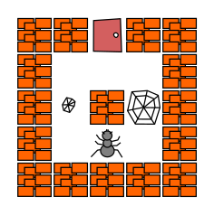

---
jupytext:
  text_representation:
    extension: .md
    format_name: myst
    format_version: 0.13
    jupytext_version: 1.15.1
kernelspec:
  display_name: Python 3 (ipykernel)
  language: python
  name: python3
---

# Semaine 1: Introduction à l'informatique et premiers programmes

## [Cours](cours.md)

## [TD : Notion d'algorithme](TD.md)

## TP : prise en main, premiers programmes avec laby

+++

**Tout exercice non marqué d'un ♣ est à terminer pour la semaine prochaine.**

+++

### Introduction

Dans ce premier TP vous allez écrire de petits programmes de façon
ludique (faire sortir une fourmi d'un labyrinthe, etc), occasion d'avoir
un premier contact avec quelques constructions (conditionnelles,
boucles, fonctions) que nous approfondirons par la suite.

Pour cela, nous utiliserons des *feuilles d'exercices interactives
`Jupyter`*. `Jupyter` est une application web qui permet de programmer
interactivement dans de nombreux langages (`Python`, `C++`, ...), un
peu comme une super calculatrice, et de rédiger des documents
interactifs.

+++

### Exercice 1 : Premiers pas avec Jupyter

1.  Ouvrez la feuille de travail
	[0a-prise-en-main-jupyter.md](0a-prise-en-main-jupyter.md).

2.  Suivez les instructions qu'elle contient.

+++

### Exercice 2 : Dépôt de votre travail

+++

1.  Revenez au tableau de bord du cours

    Indication : recherchez l'onglet ;
    si vous l'avez fermé, revenez à la
	[page d'accès au matériel pédagogique](https://Nicolas.Thiery.name/Enseignement/Info111/ComputerLab/)
	et suivez les instructions.

2.  Vérifiez le choix du groupe
3.  Déposez le devoir `Semaine1`
4.  Consultez le dépôt `Semaine1` sur GitLab.
5.  Votre travail est maintenant sauvegardé et vous pouvez y accéder
    depuis chez vous.

<!-- TODO : consultation de la correction automatique !-->

Pensez à déposer régulièrement votre travail, et systématiquement à la
fin du TP pour que tout ce que vous avez fait soit bien sauvegardé.

+++

### Exercice 3 : Premiers programmes en jouant

+++

Le jeu [`laby`](https://sgimenez.github.io/laby/) propose plusieurs
défis successifs; pour chacun d'entre eux, le but est de guider
pas-à-pas une fourmi vers la sortie d'un labyrinthe à l'aide d'un
programme. Chacun de ces défis sera l'occasion de découvrir ou
manipuler un concept de programmation.

Nous allons utiliser
[`laby-jupyter`](https://github.com/nthiery/laby-jupyter/), une
réimplantation de laby dans Jupyter.

1.  Chaque feuille ci-dessous correspond à un défi. Ouvrez les
    tour-à-tour dans l'ordre et suivez les instructions
    incluses. Déposez votre travail après chaque feuille.

	- [Laby 0b : Démonstration](0b.md)
	- [Laby 1a : À vous de jouer](1a.md)
	- [Laby 1b : Oh le caillou](1b.md)
	- [Laby 1c : Encore un caillou!](1c.md)
	- [Laby 2a : Que c'est loin ...](2a.md)
	- [Laby 2b : Le couloir des cailloux](2b.md)
	- [Laby 2c : Zig-Zag](2c.md)
	- [Laby 2d : Le Zig-Zag des cailloux](2d.md)
	- [Laby 3a : Ahhh des toiles!](3a.md)
	- [Laby 3b : Toiles et cailloux](3b.md)
	- [Laby 4a : La spirale infernale](4a.md)
	- [Laby 4b : Par où passer?](4b.md)

2.  Résoudre en Python le défi [Chou, chèvre, loup](chou-chevre-loup.md).

3.  ♣ Dans l'ordre que vous souhaiterez :

    - Reprendre en Python tout ou partie des défis de laby. Pour cela,
      vous utiliserez le tableau de bord pour télécharger le devoir
      `Semaine1Python`.

    - Résoudre en Python le [jeu des cruches](cruches.md).
    - Faire les feuilles laby supplémentaires en C++ :
		- [Laby C++ : Counting the rocks](counting-the-rocks.md)
	    - [Laby C++ : C'est fou!](this-is-crazy.md)

+++

### Exercice 4 : À faire pour la semaine prochaine

Deux heures supplémentaires de `Laby`! Vous pouvez par exemple
utiliser un ordinateur en salle libre-service de l'université (salle
215, sauf si cours) ou le service JupyterHub@Paris-Saclay. Dans tous
les cas, assurez-vous de télécharger le devoir en début de chaque
séance et de le déposer régulièrement ensuite. En particulier, le
déposer avant de vous déconnecter pour que tout ce que vous avez fait
soit bien sauvegardé.

