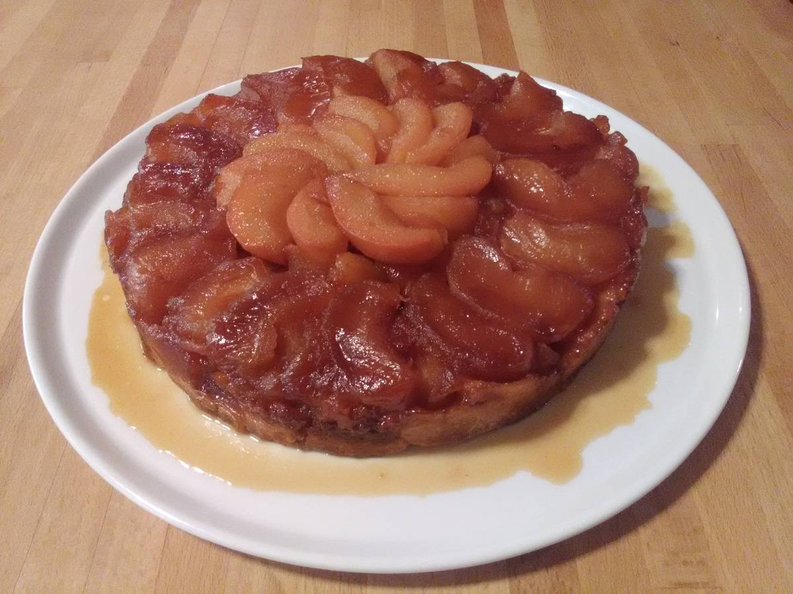
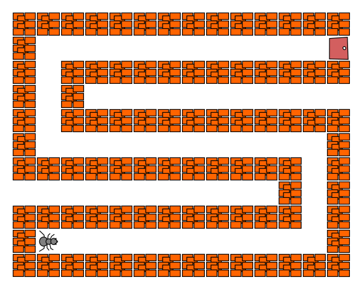
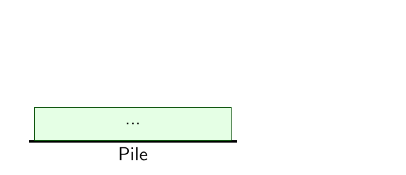
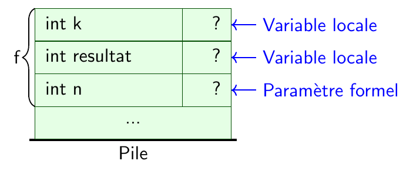
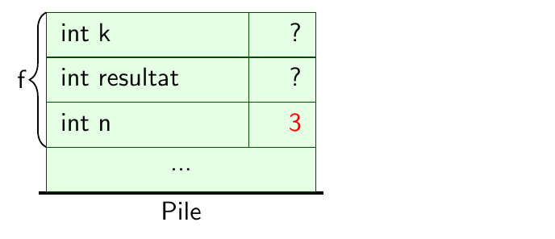
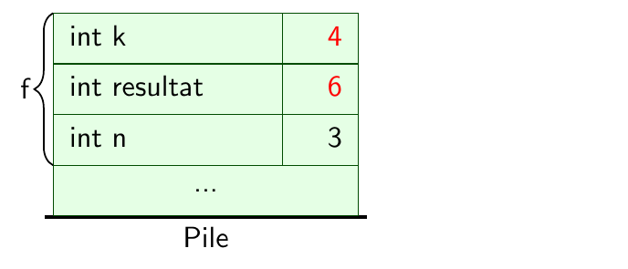
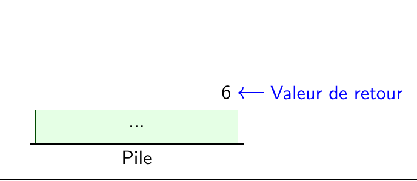

---
jupytext:
  notebook_metadata_filter: rise
  text_representation:
    extension: .md
    format_name: myst
    format_version: 0.13
    jupytext_version: 1.15.2
kernelspec:
  display_name: C++14
  language: C++14
  name: xcpp14
rise:
  auto_select: first
  autolaunch: true
  centered: false
  controls: false
  enable_chalkboard: false
  height: 100%
  margin: 0
  maxScale: 1
  minScale: 1
  scroll: true
  slideNumber: true
  start_slideshow_at: selected
  transition: none
  width: 90%
---

+++ {"editable": true, "slideshow": {"slide_type": "slide"}}

# Fonctions

+++ {"slideshow": {"slide_type": "fragment"}}

## Prélude

+++ {"slideshow": {"slide_type": "slide"}}

### Résumé des épisodes précédents ...

Pour le moment nous avons vu :

+++ {"slideshow": {"slide_type": "fragment"}}

-   Expressions: `3 * (4+5)`, `1 < x and x < 5 or y == 3`

+++ {"slideshow": {"slide_type": "fragment"}}

-   Variables, types, affectation: `int n = 1 + 1`

+++ {"slideshow": {"slide_type": "fragment"}}

-   Instruction conditionnelle: `if`

+++ {"slideshow": {"slide_type": "fragment"}}

-   Instructions itératives: `while`, `do ... while`, `for`

+++ {"slideshow": {"slide_type": "fragment"}}

Tout ce qui est calculable par un ordinateur peut être programmé
uniquement avec ces instructions  
(ou presque : il faudrait un accès un peu plus souple à la mémoire)

+++ {"slideshow": {"slide_type": "fragment"}}

**Pourquoi aller plus loin?**

+++ {"slideshow": {"slide_type": "fragment"}}

**<div style="color:red; text-align:center">Pour passer à l'échelle!</div>**

+++ {"slideshow": {"slide_type": "slide"}}

#### Motivation: l'exemple du livre de cuisine (1)

##### Recette de la tarte aux pommes

-   Ingrédients : 250 g de farine, 125 g de beurre, 1 œuf, 2 cl d'eau,
    une pincée de sel, 100 g de sucre en poudre, 5 belles pommes
-   Mettre la farine dans un récipient puis faire un puits
-   Versez dans le puits 2 cl d'eau
-   Mettre le beurre
-   Mettre le sucre et le sel
-   Pétrir de façon à former une boule
-   Étaler la pâte dans un moule
-   Peler les pommes, les couper en quartiers et les disposer sur la
    pâte
-   Faire cuire 30 minutes

+++ {"slideshow": {"slide_type": "slide"}}

#### Motivation : l'exemple du livre de cuisine (2)

##### Recette de la tarte aux poires

-   Ingrédients : 250 g de farine, 125 g de beurre, 1 œuf, 2 cl d'eau,
    une pincée de sel, 100 g de sucre en poudre, 5 belles poires
-   Mettre la farine dans un récipient puis faire un puits
-   Versez dans le puits 2 cl d'eau
-   Mettre le beurre
-   Mettre le sucre et le sel
-   Pétrir de façon à former une boule
-   Étaler la pâte dans un moule
-   Peler les poires, les couper en quartiers et les disposer sur la
    pâte
-   Faire cuire 30 minutes

+++ {"slideshow": {"slide_type": "slide"}}

#### Motivation : l'exemple du livre de cuisine (3)

##### Recette de la tarte tatin

-   Ingrédients : 250 g de farine, 125 g de beurre, 1 œuf, 2 cl d'eau,
    une pincée de sel, 200 g de sucre en poudre, 5 belles pommes
-   Mettre la farine dans un récipient puis faire un puits
-   Versez dans le puits 2 cl d'eau
-   Mettre le beurre
-   Mettre le sucre et le sel
-   Pétrir de façon à former une boule
-   Verser le sucre dans une casserole
-   Rajouter un peu d'eau pour l'humecter
-   Le faire caraméliser à feu vif, sans remuer
-   Verser au fond du plat à tarte
-   Peler les pommes, les couper en quartiers
-   Faire revenir les pommes dans une poêle avec du beurre
-   Disposer les pommes dans le plat et étaler la pâte au dessus
-   Faire cuire 45 minutes et retourner dans une assiette

+++ {"slideshow": {"slide_type": "slide"}}

#### Qu'est-ce qui ne va pas?

##### Duplications

-   Longueurs
-   En cas d'erreur ou d'amélioration :  
    plusieurs endroits à ajuster!

+++ {"slideshow": {"slide_type": "fragment"}}

##### Manque d'expressivité

-   Difficile à lire
-   Difficile à mémoriser

+++ {"slideshow": {"slide_type": "fragment"}}

**<div style="color:red; text-align:center;">Essayons d'améliorer cela</div>**

+++ {"slideshow": {"slide_type": "slide"}}

#### Recettes de base
##### Recette de la pâte brisée
-   Ingrédients : 250 g de farine, 125 g de beurre, 1 œuf, 2 cl d'eau,
    une pincée de sel
-   Mettre la farine dans un récipient puis faire un puits
-   Versez dans le puits 2 cl d'eau Mettre le beurre
-   Mettre le sucre et et une pincée de sel
-   Pétrir de façon à former une boule

+++ {"slideshow": {"slide_type": "fragment"}}

##### Recette du caramel
-   Ingrédients : 100 g de sucre
-   Verser le sucre dans une casserole
-   Rajouter un peu d'eau pour l'humecter
-   Le faire caraméliser à feu vif, sans remuer

+++ {"slideshow": {"slide_type": "slide"}}

#### Recettes de tartes

##### Tarte aux fruits (pommes, poires, prunes, ...)
-   Ingrédients : 500g de fruits, ingrédients pour une pâte brisée
-   *Préparer une pâte brisée*
-   Étaler la pâte dans un moule
-   Peler les fruits, les couper en quartiers et les disposer sur la
    pâte
-   Faire cuire 30 minutes

+++ {"slideshow": {"slide_type": "fragment"}}

##### Tarte tatin

::::{grid}
:::{grid-item-card}
-   Ingrédients : 5 belles pommes, ingrédients pour pâte brisée et caramel
-   *Préparer une pâte brisée*
-   *Préparer un caramel* et le verser au fond du plat à tarte
-   Peler les pommes, les couper en quartiers
-   Faire revenir les pommes dans une poêle avec du beurre
-   Disposer les pommes dans le plat, et étaler la pâte au dessus
-   Faire cuire 45 minutes et retourner dans une assiette
:::
:::{grid-item-card}

:::
::::

+++ {"slideshow": {"slide_type": "slide"}}

#### Les *fonctions* : objectif

+++ {"slideshow": {"slide_type": "slide"}}

##### Modularité
-   Décomposer un programme en programmes plus simples
-   Implantation plus facile
-   Validation (tests)
-   Réutilisation
-   Flexibilité (remplacement d'un sous-programme par un autre)

+++ {"slideshow": {"slide_type": "fragment"}}

##### Non duplication
-   Partager (*factoriser*) du code
-   Code plus court
-   Maintenance plus facile

+++ {"slideshow": {"slide_type": "fragment"}}

##### Niveau d'abstraction
-   Programmes plus *concis* et *expressifs*

+++ {"editable": true, "slideshow": {"slide_type": "slide"}}

#### Une impression de déjà vu? (1)

<!-- TODO IMG -->

::::{grid}
:::{grid-item-card}

```c++
while ( regarde() == Vide ) {
    avance();
}
gauche();
while ( regarde() == Vide ) {
    avance();
}
gauche();
```
```c++
while ( regarde() == Vide ) {
    avance();
}
droite();
while ( regarde() == Vide ) {
    avance();
}
droite();
```
```c++
while ( regarde() == Vide ) {
    avance();
}
ouvre();
```
:::
:::{grid-item-card}

:::
::::

+++ {"slideshow": {"slide_type": "slide"}}

#### Une impression de déjà vu? (2)

<!-- TODO IMG -->

::::{grid}
:::{grid-item-card}
```c++
void avance_tant_que_tu_peux() {
    while ( regarde() == Vide ) {
        avance();
    }
}
```
```c++
avance_tant_que_tu_peux();
gauche();
avance_tant_que_tu_peux();
gauche();
avance_tant_que_tu_peux();
droite();
avance_tant_que_tu_peux();
droite();
avance_tant_que_tu_peux();
ouvre();
```
:::
:::{grid-item-card}

:::
::::

+++ {"slideshow": {"slide_type": "slide"}}

#### Une impression de déjà vu? (3)

**Fonctions que vous avez déjà écrites :**

-   TD1 : `transporte(Chèvre)`
-   TP1 : `avance_tant_que_tu_peux()`
-   TD2 : `max2(note1, note2)`, `max3(note1, note2, note3)`, ...
-   TP3 : `factorielle(n)`, ...

+++ {"slideshow": {"slide_type": "slide"}}

## Fonctions

+++ {"slideshow": {"slide_type": "fragment"}}

### Appels de fonctions usuelles

#### Exemples

Chargement de la bibliothèque de fonctions mathématiques usuelles :

```{code-cell}
---
slideshow:
  slide_type: fragment
---
#include <cmath>
```

+++ {"slideshow": {"slide_type": "fragment"}}

Fonctions trigonométriques :

```{code-cell}
---
slideshow:
  slide_type: fragment
---
cos(3.14159)
```

+++ {"slideshow": {"slide_type": "fragment"}}

Fonction exponentielle :

```{code-cell}
---
slideshow:
  slide_type: fragment
---
exp(1.0)
```

+++ {"slideshow": {"slide_type": "fragment"}}

Fonction puissance :

```{code-cell}
---
slideshow:
  slide_type: fragment
---
pow(3, 2)
```

```{code-cell}
---
slideshow:
  slide_type: fragment
---
pow(2, 3)
```

<!-- -->

+++ {"slideshow": {"slide_type": "slide"}}

#### On remarque

-   La présence de `#include <cmath>`  
    C'est pour utiliser la bibliothèque de fonctions mathématiques  
    On y reviendra ...

+++ {"slideshow": {"slide_type": "fragment"}}

-   L'ordre des arguments est important
-   Le type des arguments est important

+++ {"slideshow": {"slide_type": "fragment"}}

-   On sait ce que calcule `cos(x)`!
-   On ne sait pas **comment** il le fait
-   **On n'a pas besoin de le savoir**

+++ {"slideshow": {"slide_type": "slide"}}

### Écrire ses propres fonctions : la fonction factorielle

+++ {"slideshow": {"slide_type": "fragment"}}

#### À la main

+++ {"slideshow": {"slide_type": "fragment"}}

Calculons $5!$ :

```{code-cell}
---
slideshow:
  slide_type: fragment
---
int resultat = 1;
for ( int i = 1; i <= 5; i++ ) {
    resultat = resultat * i;
}
resultat
```

+++ {"slideshow": {"slide_type": "fragment"}}

Calculons 7! :

```{code-cell}
---
slideshow:
  slide_type: fragment
---
int resultat = 1;
for ( int i = 1; i <= 7; i++ ) {
    resultat = resultat * i;
}
resultat
```

+++ {"slideshow": {"slide_type": "fragment"}}

#### Avec une fonction

```{code-cell}
---
slideshow:
  slide_type: fragment
---
int factorielle(int n) {
    int resultat = 1;
    for ( int i = 1; i <= n; i++ ) {
        resultat = resultat * i;
    }
    return resultat;
}
```

```{code-cell}
---
slideshow:
  slide_type: fragment
---
factorielle(5)
```

```{code-cell}
---
slideshow:
  slide_type: fragment
---
factorielle(7)
```

```{code-cell}
---
slideshow:
  slide_type: fragment
---
factorielle(5) / factorielle(3) / factorielle(2)
```

<!-- -->

+++ {"slideshow": {"slide_type": "slide"}}

### Syntaxe d'une fonction

**Syntaxe :**

``` c++
type nom(type1 parametre1, type2 parametre2, ...) {
    déclarations de variables;
    bloc d instructions;
    return expression;
}
```
-   `parametre1, parametre2, ...` : les **paramètres formels**
-   Le type des paramètres formels est fixé
-   Les variables sont appelées **variables locales**
-   À la fin, la fonction **renvoie** la valeur de `expression`  
    Celle-ci doit être du type annoncé

+++ {"slideshow": {"slide_type": "slide"}}

### Sémantique simplifiée de l'appel de fonction

Revenons sur la fonction `max`

```{code-cell}
---
slideshow:
  slide_type: fragment
---
float max(float a, float b) {
    if ( a >= b ) {
        return a;
    } else {
        return b;
    }
}
```

+++ {"slideshow": {"slide_type": "fragment"}}

-   `max` n'est utilisée que si elle est *appelée*

+++ {"slideshow": {"slide_type": "fragment"}}

-   Pour appeler cette fonction on écrit par exemple

```{code-cell}
---
slideshow:
  slide_type: fragment
---
max(1.5, 3.0)
```

+++ {"slideshow": {"slide_type": "fragment"}}

1.   les **paramètres** `a` et `b` sont initialisés avec les valeurs `1.5` et `3.0`

+++ {"slideshow": {"slide_type": "fragment"}}

2.  le code de la fonction est exécuté

+++ {"slideshow": {"slide_type": "fragment"}}

3.  l'exécution s'arrête au premier `return` rencontré

+++ {"slideshow": {"slide_type": "fragment"}}

4.  le `return` spécifie la **valeur de retour** de la fonction :  
    la valeur de l'expression `max(1.5, 3.0)`

+++ {"slideshow": {"slide_type": "slide"}}

## Documentation et tests

+++ {"slideshow": {"slide_type": "fragment"}}

### Documentation d'une fonction (syntaxe javadoc)

**Exemple :**

``` c++
/** Fonction qui calcule la factorielle
 *  @param n un nombre entier positif
 *  @return n!
 **/
int factorielle(int n) ...
```

+++ {"slideshow": {"slide_type": "fragment"}}

**Une bonne documentation :**

-   Est concise et précise
-   Donne les *préconditions* sur les paramètres
-   Décrit le résultat (ce que fait la fonction)

+++ {"slideshow": {"slide_type": "fragment"}}

**Astuce pour être efficace :**

-   *Toujours commencer par écrire la documentation*  
    De toute façon il faut réfléchir à ce que la fonction va faire!

+++ {"slideshow": {"slide_type": "slide"}}

### Tests d'une fonction

-   Pas d'infrastructure standard en C++ pour écrire des tests
-   Dans ce cours, on utilisera [doctest](https://github.com/onqtam/doctest#readme)

+++ {"slideshow": {"slide_type": "fragment"}}

**Exemple :**

```{code-cell}
---
slideshow:
  slide_type: fragment
---
int factorielle(int n) {
    int resultat = 1;
    for ( int i = 1; i <= n; i++ ) {
        resultat = resultat * i;
    }
    return resultat;
}
```

```{code-cell}
---
slideshow:
  slide_type: fragment
---
CHECK( factorielle(0) == 1  );
CHECK( factorielle(1) == 1  );
CHECK( factorielle(2) == 2  );
CHECK( factorielle(3) == 6  );
CHECK( factorielle(4) == 24 );
```

+++ {"slideshow": {"slide_type": "fragment"}}

<!-- **Note :** jusqu'en 2020-2021, ainsi que les trois premières séances de
2021-2022, ce cours utilisait le nom `ASSERT` au lieu de `CHECK`. Le
changement a eu lieu pour assurer la compatibilité avec
l'infrastructure `doctest`. Pour simplifier la transition, dans
l'environnement Jupyter de ce cours, on peut utiliser les deux
indifféremment. -->

+++ {"slideshow": {"slide_type": "slide"}}

#### Tests d'une fonction

**Astuces pour être efficace :**

-   *Commencer par écrire les tests d'une fonction*  
    De toute façon il faut réfléchir à ce qu'elle va faire!

+++ {"slideshow": {"slide_type": "fragment"}}

-   Tester les cas particuliers

+++ {"slideshow": {"slide_type": "fragment"}}

-   Tant que l'on est pas sûr que la fonction est correcte :
    -   Faire des essais supplémentaires
    -   Capitaliser ces essais sous forme de tests

+++ {"slideshow": {"slide_type": "fragment"}}

-   Si l'on trouve un bogue :
    -   Ajouter un test caractérisant le bogue

+++ {"slideshow": {"slide_type": "fragment"}}

-   Les *effets de bord* sont durs à tester!

+++ {"slideshow": {"slide_type": "slide"}}

## Modèle d'exécution

+++ {"slideshow": {"slide_type": "fragment"}}

### Motivation

+++ {"slideshow": {"slide_type": "fragment"}}

#### Exercice

On considère la fonction `incremente` :

```{code-cell}
---
slideshow:
  slide_type: fragment
---
int incremente(int n) {
    n = n + 1;
    return n;
}
```

+++ {"slideshow": {"slide_type": "fragment"}}

Quelles sont les valeurs de `a` et `b` après l'exécution des lignes
suivantes :

```{code-cell}
---
slideshow:
  slide_type: fragment
---
int a, b;

a = 1;
b = incremente(a);
```

+++ {"slideshow": {"slide_type": "fragment"}}

Deux possibilités paraissent envisageables :

- `a=1` et `b=2`
- `a=2` et `b=2`

Laquelle en C++?

+++ {"slideshow": {"slide_type": "slide"}}

#### Motivation

Comprendre précisément l'*appel de fonction*

+++ {"slideshow": {"slide_type": "fragment"}}

#### Exemple : appel de la fonction factorielle

```{code-cell}
---
slideshow:
  slide_type: fragment
---
int factorielle(int n) {
    int resultat = 1;
    for ( int k = 1; k <= n; k++ ) {
        resultat = resultat * k;
    }
    return resultat;
}
```

+++ {"slideshow": {"slide_type": "fragment"}}

Que se passe-t-il lorsque l'on évalue l'expression suivante?

```{code-cell}
---
slideshow:
  slide_type: fragment
---
factorielle(1+2)
```

+++ {"slideshow": {"slide_type": "slide"}}

### Appel de fonctions : formalisation

+++ {"slideshow": {"slide_type": "fragment"}}

#### Syntaxe

``` c++
nom(expression1, expression2, ...)
```

+++ {"slideshow": {"slide_type": "fragment"}}

#### Sémantique

+++ {"slideshow": {"slide_type": "fragment"}}

1.  Evaluation des expressions  
    Leurs valeurs sont les **paramètres réels**

+++ {"slideshow": {"slide_type": "fragment"}}

2.  Allocation de mémoire sur la **pile** pour :
    -   Les variables locales
    -   Les paramètres formels

+++ {"slideshow": {"slide_type": "fragment"}}

3.  Affectation des paramètres réels aux paramètres formels  
    (par copie; les types doivent correspondre!)

+++ {"slideshow": {"slide_type": "fragment"}}

4.  Exécution des instructions

+++ {"slideshow": {"slide_type": "fragment"}}

5.  Lorsque `return expression` est rencontré, évaluation de
    l'expression qui donne la **valeur de retour de la fonction**

+++ {"slideshow": {"slide_type": "fragment"}}

6.  Désallocation des variables et paramètres sur la pile

+++ {"slideshow": {"slide_type": "fragment"}}

7.  La valeur de l'expression `nom(...)` est donnée par la valeur de
    retour

+++ {"slideshow": {"slide_type": "slide"}}

#### Évolution de la pile sur l'exemple

::::{grid}
:::{grid-item-card}
1. État initial
:::
:::{grid-item-card}

:::
::::

+++ {"slideshow": {"slide_type": "fragment"}}

::::{grid}
:::{grid-item-card}
1. Allocation de la mémoire sur la pile 
:::
:::{grid-item-card}

:::
::::

+++ {"slideshow": {"slide_type": "fragment"}}

::::{grid}
:::{grid-item-card}
3 : Affectation du paramètre réel au paramètre formel
:::
:::{grid-item-card}

:::
::::

+++ {"slideshow": {"slide_type": "fragment"}}

::::{grid}
:::{grid-item-card}
4 : Exécution des instructions
:::
:::{grid-item-card}

:::
::::

+++ {"slideshow": {"slide_type": "fragment"}}

::::{grid}
:::{grid-item-card}
5,6,7 : Désallocation de la mémoire sur la pile et valeur de retour
:::
:::{grid-item-card}

:::
::::

+++ {"slideshow": {"slide_type": "slide"}}

### Appel de fonctions : retour sur l'exercice

```{code-cell}
---
slideshow:
  slide_type: fragment
---
int incremente(int n) {
    n = n + 1;
    return n;
}
```

+++ {"slideshow": {"slide_type": "fragment"}}

Appliquez la sémantique détaillée de l'appel de fonction pour
déterminer les valeurs de `a` et `b` après l'exécution des lignes
suivantes :

```{code-cell}
---
slideshow:
  slide_type: fragment
---
int a, b;

a = 1;
b = incremente(a);
```

```{code-cell}
---
slideshow:
  slide_type: fragment
---
a
```

```{code-cell}
---
slideshow:
  slide_type: fragment
---
b
```

<!-- -->

+++ {"slideshow": {"slide_type": "slide"}}

### Passage des paramètres par valeur

-   Les paramètres formels d'une fonction sont des variables comme les
    autres.
-   On peut les modifier.
-   Mais ...

#### Rappel

Lors d'un appel de fonction ou de procédure, la valeur du paramètre réel
est **copiée** dans le paramètre formel.

#### Conséquence

-   Une modification du paramètre formel n'affecte pas le paramètre
    réel
-   Si la variable est volumineuse (tableaux, chaîne de caractères,
    etc.), cette copie peut être coûteuse

On dit que les paramètres sont passés **par valeur**.

Au second semestre, vous verrez le passage de paramètres **par référence**.

+++ {"slideshow": {"slide_type": "slide"}}

## Fonctions particulières

1.  Procédures
2.  Fonctions récursives

+++ {"slideshow": {"slide_type": "slide"}}

### Fonctions particulières : procédures

Besoin de sous-programmes qui *agissent* au lieu de *calculer* :
-   On veut produire un effet (affichage, musique, *etc*)
-   On veut modifier l'état interne d'une structure de donnée

On parle d'**effet de bord**

+++ {"slideshow": {"slide_type": "fragment"}}

**Exemple :**

``` c++
void avance_tant_que_tu_peux() {
    while ( regarde() == Vide ) {
        avance();
    }
}
```

+++ {"slideshow": {"slide_type": "fragment"}}

-   Cette fonction ne renvoie rien
-   On le dénote en C++ par le type `void`
-   Dans d'autres langages on distingue **fonctions** et **procédures**

+++ {"slideshow": {"slide_type": "fragment"}}

-   Autres exemples : `transporte(...)`, `gauche()`

+++ {"slideshow": {"slide_type": "slide"}}

### Fonctions particulières : fonctions récursives ♣

``` c++
int factorielle(int n) {
    if ( n == 0 ) {
        return 1;
    } else {
        return n * factorielle(n-1);
    }
}
```

+++

Une ***fonction*** récursive est une fonction qui s'appelle
elle-même.

Cela peut paraître étrange de définir un objet à partir de lui-même,
mais c'est comme pour les suites définies par récurrence en
mathématiques: il faut et il suffit de s'assurer d'avoir un cas de
base et une étape de récurrence bien posée.

**Exercice :**

- Exécuter pas à pas :
    - `factorielle(0)`
    - `factorielle(3)`
    - `factorielle(-1)`

+++ {"slideshow": {"slide_type": "slide"}}

## Résumé

+++ {"slideshow": {"slide_type": "fragment"}}

### Motivation

-   Modularité
-   Lutte contre la duplication
-   Programmes plus concis et expressifs

+++ {"slideshow": {"slide_type": "fragment"}}

### Fonctions

-   Combinaison d'instructions élémentaires donnant une instruction de
    plus haut niveau
-   Modèle d'exécution (pile)
-   Procédures, fonctions récursives

+++ {"slideshow": {"slide_type": "fragment"}}

### Trilogie

-   *Documentation* : ce que fait la fonction (entrées, sorties, ...)
-   *Tests* : ce que fait la fonction (exemples)
-   *Code* : comment elle le fait

```{code-cell}

```

