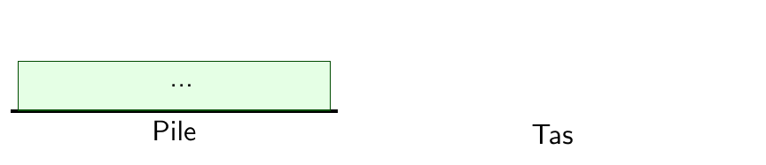
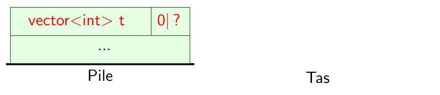
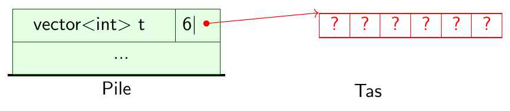
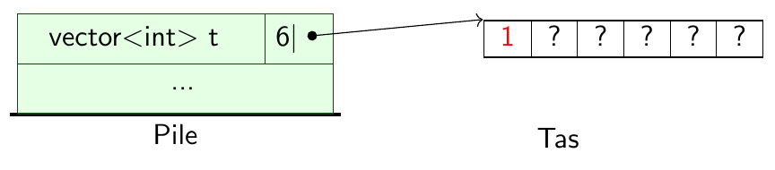
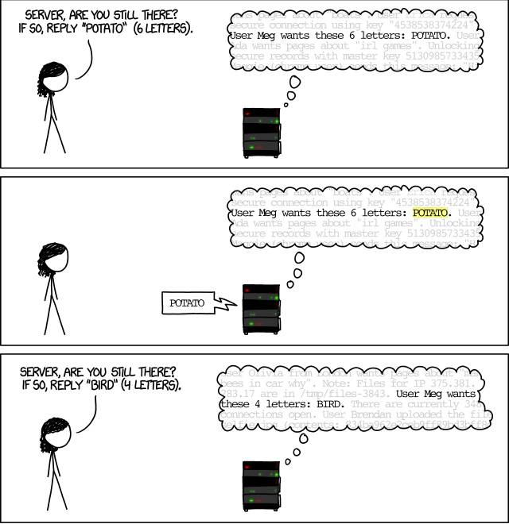
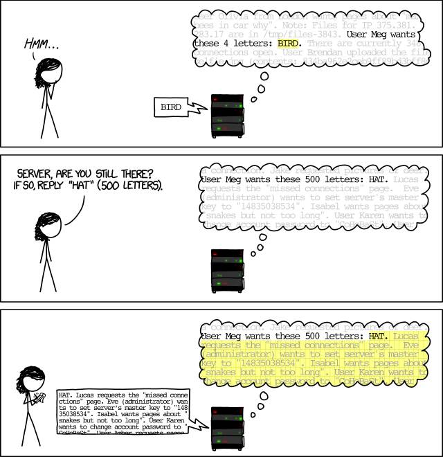

---
jupytext:
  text_representation:
    extension: .md
    format_name: myst
    format_version: 0.13
kernelspec:
  display_name: C++17
  language: C++17
  name: xcpp17
rise:
  auto_select: first
  autolaunch: true
  centered: false
  controls: false
  enable_chalkboard: true
  height: 100%
  margin: 0
  maxScale: 1
  minScale: 1
  scroll: true
  slideNumber: true
  start_slideshow_at: selected
  transition: none
  width: 90%
---

+++ {"slideshow": {"slide_type": "slide"}}

# Modèle de mémoire et tableaux

:::{prf:definition} Pile et tas
L'espace mémoire d'un programme est partagé en deux zones :

-   La ***pile*** : variables locales des fonctions
-   Le ***tas*** : le reste
:::

+++ {"slideshow": {"slide_type": "fragment"}}

## Exemple de construction d'un tableau

```{code-cell}
#include<vector>
using namespace std;
```

```{code-cell}
---
slideshow:
  slide_type: fragment
---
vector<int> t;      // Déclaration
t = vector<int>(6); // Allocation
t[0] = 1;           // Initialisation
t[1] = 4;
t[2] = 1;
t[3] = 5;
t[4] = 9;
```

+++ {"slideshow": {"slide_type": "slide"}}

### Exemple de construction d'un tableau : mémoire

0. État initial

    %
    :::{image} media/pile-tas-etat-initial.png
    :::

+++ {"slideshow": {"slide_type": "fragment"}}

1.  Déclaration du tableau

    ``` c++
        vector<int> t;
    ```

    %
    :::{image} media/pile-tas-declaration.png
    :::

+++ {"slideshow": {"slide_type": "fragment"}}

2.  Allocation du tableau

    ``` c++
        t = vector<int>(6);
    ```

    %
    :::{image} media/pile-tas-allocation.png
    :::

+++ {"slideshow": {"slide_type": "fragment"}}

3.  Initialisation

    ``` c++
        t[0] = 1;
        ...
    ```

    %
    :::{image} media/pile-tas-initialisation-1.png
    :::

+++ {"slideshow": {"slide_type": "slide"}}

:::{admonition} Sémantique : allocation d'un tableau

``` c++
t = vector<int>(6);
```

1.  Une suite contiguë de cases est allouée sur le tas
2.  La taille et une référence vers la première des cases est stockée
    dans `t`
:::

+++ {"slideshow": {"slide_type": "fragment"}}

:::{admonition} Sémantique : lecture et écriture dans un tableau

``` c++
t[i]
```

-   La `i`-ème case du tableau
-   Obtenue en suivant la référence et se décalant de $i$ cases
-   Rappel : *pas de vérifications!!!*
:::

+++ {"slideshow": {"slide_type": "slide"}}

## Retour sur l'[exemple de piratage par débordement](cours-login.md)

+++ {"slideshow": {"slide_type": "slide"}}

### Heartblead expliqué (<http://xkcd.com/1354/>)

:::::{grid}
::::{grid-item-card}
:::{image} media/xkcd_heartbleed_explanation_1.jpg
:::
::::
::::{grid-item-card}
:::{image} media/xkcd_heartbleed_explanation_1.jpg
:::
::::
:::::

%

+++ {"slideshow": {"slide_type": "slide"}}

## Tableaux et allocation mémoire

:::{hint} À retenir

-   Une valeur de type tableau ne contient pas directement les cases du
    tableau, mais l'adresse en mémoire de celles-ci (référence) et la
    taille du tableau.
:::

+++ {"slideshow": {"slide_type": "fragment"}}

:::{hint} À retenir
-   Une variable de type tableau se construit en trois étapes :

    1.  Déclaration

    2.  Allocation  
        Sans cela : *faute de segmentation* (au mieux!)

    3.  Initialisation  
        Sans cela : même problème qu'avec les variables usuelles
:::

+++ {"slideshow": {"slide_type": "fragment"}}

:::{hint} À retenir
-   Lors de l'accès à une case `i` d'un tableau `t`, il faut toujours
    vérifier les bornes : `0 <= i` et `i < t.size()`  
    Sans cela : *faute de segmentation* (au mieux!)
:::

+++ {"slideshow": {"slide_type": "slide"}}

## Sémantique : affectation de tableaux

+++ {"slideshow": {"slide_type": "fragment"}, "tags": []}

:::{prf:example}

Quelles sont les valeurs de `t[0]` et `t2[0]` après l'exécution du
programme suivant?
:::

```{code-cell}
---
slideshow:
  slide_type: null
tags: []
---
vector<int> t = { 1, 4, 1, 5, 9, 2 };
vector<int> t2;
t2 = t;             // Affectation
t2[0] = 0;
```

```{code-cell}
:tags: []

t[0]
```

```{code-cell}
:tags: []

t2[0]
```

+++ {"slideshow": {"slide_type": "fragment"}}

:::{hint} À retenir

-   En C++, lors d'une affectation, un `vector` est *copié*!
-   On dit que `vector` a une **sémantique de copie**.
-   Différent de Java, Python ou des tableaux C!
:::

+++ {"slideshow": {"slide_type": "slide"}}

## Sémantique : tableaux et fonctions ♣

+++ {"slideshow": {"slide_type": "fragment"}, "tags": []}

:::{prf:example}
Quelle est la valeur de `tableau[0]` après l'exécution du programme
suivant?
:::

```{code-cell}
---
slideshow:
  slide_type: null
tags: []
---
#include <vector>
using namespace std;
using tableau = vector<int>;
```

```{code-cell}
---
slideshow:
  slide_type: null
tags: []
---
void modifie(vector<int> t) {
    t[0] = 42;
}
```

```{code-cell}
:tags: []

vector<int> tableau = { 1, 2, 3, 4 };
modifie(tableau)
```

```{code-cell}
:tags: []

tableau[0]
```

+++ {"slideshow": {"slide_type": "fragment"}}

:::{hint} Fonctions et tableaux
En combinant la sémantique de l'appel de fonction et celle d'affectation de tableaux, on déduit que :
% TODO: liens croisés
-   Appel de fonction $\Longrightarrow$ Affectation des paramètres $\Longrightarrow$ copie
-   Donc, les `vector` de C++ sont passés **par valeur** aux fonctions
:::

+++ {"slideshow": {"slide_type": "fragment"}}

:::{tip} Astuce
La fonction peut **renvoyer** le tableau modifié!
:::

```{code-cell}
---
slideshow:
  slide_type: null
tags: []
---
#include <vector>
using namespace std;
using tableau = vector<int>;
```

```{code-cell}
---
slideshow:
  slide_type: null
tags: []
---
tableau modifie(vector<int> t) {
    t[0] = 42;
    return t;
}
```

```{code-cell}
:tags: []

vector<int> tableau = { 1, 2, 3, 4 };
tableau = modifie(tableau)
```

```{code-cell}
:tags: []

tableau[0]
```

+++ {"slideshow": {"slide_type": "notes"}, "tags": []}

:::{note}
Vous verrez au second semestre comment passer les tableaux par référence aux fonctions, notamment pour des questions de performances.
:::
