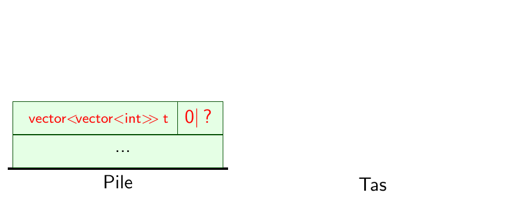
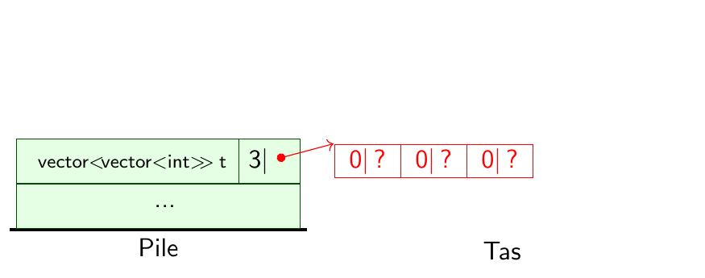
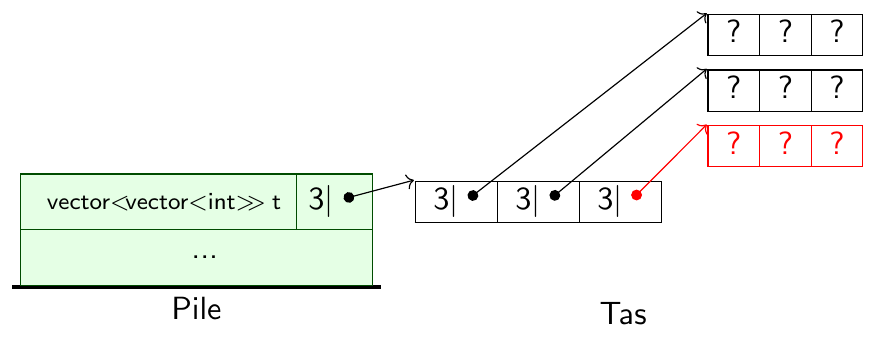
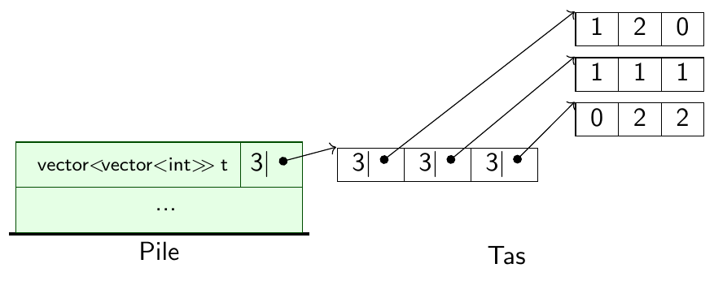

---
jupytext:
  text_representation:
    extension: .md
    format_name: myst
    format_version: 0.13
kernelspec:
  display_name: C++17
  language: C++17
  name: xcpp17
rise:
  auto_select: first
  autolaunch: true
  centered: false
  controls: false
  enable_chalkboard: true
  height: 100%
  margin: 0
  maxScale: 1
  minScale: 1
  scroll: true
  slideNumber: true
  start_slideshow_at: selected
  transition: none
  width: 90%
---

+++ {"slideshow": {"slide_type": "slide"}}

# Tableaux à deux dimensions

+++ {"slideshow": {"slide_type": "slide"}}

## Motivation : Le jeu de morpion

On voudrait modéliser le plateau d'un jeu de morpion :

<table>
    <tr><td style="border: 1px solid">X</td><td style="border: 1px solid">O</td><td style="border: 1px solid"></td></tr>
    <tr><td style="border: 1px solid">X</td><td style="border: 1px solid">X</td><td style="border: 1px solid">X</td></tr>
    <tr><td style="border: 1px solid"> </td><td style="border: 1px solid">O</td><td style="border: 1px solid">O</td></tr>
</table>

+++ {"slideshow": {"slide_type": "fragment"}}

C'est comme un tableau, mais à deux dimensions: numéro de ligne, numéro de colonne

<table>
    <tr><td style="border: 0px solid"></td><td>0</td><td>1</td><td>2</td></tr>
    <tr><td style="border: 0px solid">0</td><td style="border: 1px solid">X</td><td style="border: 1px solid">O</td><td style="border: 1px solid"></td></tr>
    <tr><td style="border: 0px solid">1</td><td style="border: 1px solid">X</td><td style="border: 1px solid">X</td><td style="border: 1px solid">X</td></tr>
    <tr><td style="border: 0px solid">2</td><td style="border: 1px solid"> </td><td style="border: 1px solid">O</td><td style="border: 1px solid">O</td></tr>
</table>

+++ {"slideshow": {"slide_type": "slide"}}

### Comment modéliser un plateau de morpion en C++?

+++ {"slideshow": {"slide_type": "fragment"}}

- modéliser une case : un entier : `int`
  - `0` : pas de pion
  - `1` : pion joueur 1 : X
  - `2` : pion joueur 2 : O

```{code-cell}
---
slideshow:
  slide_type: fragment
tags: []
---
int c = 2;
```

+++ {"slideshow": {"slide_type": "fragment"}}

- modéliser une ligne : un tableau d'entiers : `vector<int>`

```{code-cell}
---
slideshow:
  slide_type: fragment
---
#include <vector> 
using namespace std;
```

+++ {"slideshow": {"slide_type": null}, "tags": []}

<table>
    <tr><td style="border: 0px solid"></td><td>0</td><td>1</td><td>2</td></tr>
    <tr><td style="border: 0px solid">0</td><td style="border: 1px solid">X</td><td style="border: 1px solid">O</td><td style="border: 1px solid"></td></tr>
</table>

```{code-cell}
---
slideshow:
  slide_type: null
tags: []
---
vector<int> ligne0 = { 1, 2, 0 };
```

+++ {"slideshow": {"slide_type": "fragment"}}

<table>
    <tr><td style="border: 0px solid"></td><td>0</td><td>1</td><td>2</td></tr>
    <tr><td style="border: 0px solid">1</td><td style="border: 1px solid">X</td><td style="border: 1px solid">X</td><td style="border: 1px solid">X</td></tr>
</table>

```{code-cell}
---
slideshow:
  slide_type: null
tags: []
---
vector<int> ligne1 = { 1, 1, 1 };
```

+++ {"slideshow": {"slide_type": "fragment"}}

<table>
    <tr><td style="border: 0px solid"></td><td>0</td><td>1</td><td>2</td></tr>
    <tr><td style="border: 0px solid">2</td><td style="border: 1px solid"> </td><td style="border: 1px solid">O</td><td style="border: 1px solid">O</td></tr>
</table>

```{code-cell}
---
slideshow:
  slide_type: null
tags: []
---
vector<int> ligne2 = { 0, 2, 2 };
```

+++ {"slideshow": {"slide_type": "fragment"}}

- modéliser le plateau : un tableau de tableaux : `vector<vector<int>>`

```{code-cell}
---
slideshow:
  slide_type: null
tags: []
---
vector<vector<int>>  plateau = { ligne0, ligne1, ligne2 };
```

```{code-cell}
:tags: []

plateau
```

+++ {"slideshow": {"slide_type": "fragment"}}

En version courte :

```{code-cell}
---
slideshow:
  slide_type: null
tags: []
---
vector<vector<int>> plateau = {
    { 1, 2, 0 },
    { 1, 1, 1 },
    { 0, 2, 2 },
};
```

+++ {"slideshow": {"slide_type": "slide"}}

### Utilisation du tableau de Morpion

```{code-cell}
---
slideshow:
  slide_type: fragment
---
#include <iostream>
```

+++ {"slideshow": {"slide_type": "fragment"}}

Accès par indices de ligne et de colonne :

```{code-cell}
---
slideshow:
  slide_type: fragment
---
for ( int i = 0; i < plateau.size(); i++ ) {
    for ( int j = 0; j < plateau[i].size(); j++ ) {
        if      ( plateau[i][j] == 1 ) cout << "X ";
        else if ( plateau[i][j] == 2 ) cout << "O ";
        else                           cout << "  ";
    }
    cout << endl;
}
```

+++ {"slideshow": {"slide_type": "fragment"}}

Avec une boucle «pour tout» :

```{code-cell}
---
slideshow:
  slide_type: fragment
---
for ( auto ligne: plateau ) {
    for ( auto c: ligne ) {
        if      ( c == 1 ) cout << "X ";
        else if ( c == 2 ) cout << "O ";
        else               cout << "  ";
    }
    cout << endl;
}
```

+++ {"slideshow": {"slide_type": "slide"}}

## Construction d'un tableau à deux dimensions

```{code-cell}
#include <vector>
using namespace std;
```

+++ {"slideshow": {"slide_type": "fragment"}}

En une seule étape :

```{code-cell}
---
slideshow:
  slide_type: null
tags: []
---
vector<vector<int>> plateau = {
    { 1, 2, 0 },
    { 1, 1, 1 },
    { 0, 2, 2 },
};
```

+++ {"slideshow": {"slide_type": "fragment"}}

Construction d'un tableau étape par étape :

+++ {"slideshow": {"slide_type": "fragment"}}

- **Déclaration :**

```{code-cell}
---
slideshow:
  slide_type: null
tags: []
---
vector<vector<int>> plateau;
```

+++ {"slideshow": {"slide_type": "fragment"}}

- **Allocation :**

```{code-cell}
---
slideshow:
  slide_type: null
tags: []
---
plateau = vector<vector<int>>(3);
```

+++ {"slideshow": {"slide_type": "fragment"}}

- **Allocation des sous-tableaux :**

```{code-cell}
---
slideshow:
  slide_type: null
tags: []
---
for ( int i = 0; i < plateau.size(); i++ )
    plateau[i] = vector<int>(3);
```

+++ {"slideshow": {"slide_type": "fragment"}}

- **Initialisation :**

```{code-cell}
---
slideshow:
  slide_type: null
tags: []
---
plateau[0][0] = 1; plateau[0][1] = 2; plateau[0][2] = 0;
plateau[1][0] = 1; plateau[1][1] = 1; plateau[1][2] = 1;
plateau[2][0] = 0; plateau[2][1] = 2; plateau[2][2] = 2;
```

+++ {"slideshow": {"slide_type": "slide"}}

### Que se passe-t'il en mémoire?

+++ {"slideshow": {"slide_type": "fragment"}, "tags": []}

0. État initial

    :::{image} media/pile-tas-etat-initial.png
    :style: "margin: auto"
    :height: 10ex
    :alt: état initial de la pile et du tas
    :::

+++ {"slideshow": {"slide_type": "fragment"}, "tags": []}

2.  Déclaration du tableau

    % 
    :::{image} media/pile-tas-declaration.png
    :style: "margin: auto"
    :height: 10ex
    :alt: pile et tas après la déclaration
    :::

+++ {"slideshow": {"slide_type": "fragment"}, "tags": []}

3.  Allocation du tableau

    % 
    :::{image} media/pile-tas-allocation.png
    :style: "margin: auto"
    :height: 10ex
    :alt: pile et tas après l'allocation
    :::

+++ {"slideshow": {"slide_type": "fragment"}, "tags": []}

4.  Allocation des sous-tableaux

    % 
    :::{image} media/pile-tas-allocation-sous-tableaux.png
    :style: "margin: auto"
    :height: 10ex
    :alt: pile et tas après l'allocation des sous tableaux
    :::

+++ {"jupyterlab-deck": {"layer": "fragment"}, "slideshow": {"slide_type": "fragment"}, "tags": []}

4.  Initialisation

    % 
    :::{image} media/pile-tas-initialisation.png
    :style: "margin: auto"
    :height: 10ex
    :alt: pile et tas après l'initialisation
    :::

+++ {"slideshow": {"slide_type": "slide"}}

## Tableaux à deux dimensions : résumé

+++ {"slideshow": {"slide_type": "fragment"}}

-   On modélise un tableau à deux dimensions par un tableau de
    tableaux : `vector<vector<...>>`

+++ {"slideshow": {"slide_type": "fragment"}}

-   `t[i][j]`: la case $t_{i,j}$ du tableau d'indice de ligne $i$ et
    d'indice de colonne $j$.  
    (on aurait pu prendre l'autre convention)

+++ {"slideshow": {"slide_type": "fragment"}}

-   Un tableau à deux dimension se construit en quatre étapes :

    1.  **Déclaration** du tableau
    2.  **Allocation** du tableau
    3.  **Allocation** des sous-tableaux
    4.  **Initialisation**

