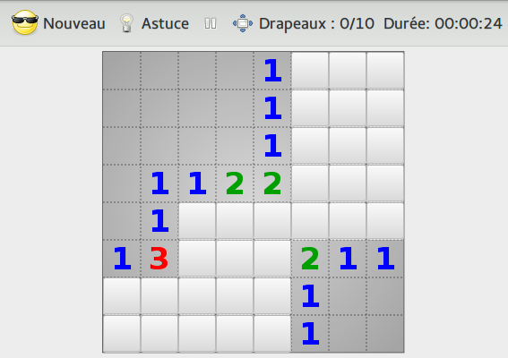

---
jupytext:
  text_representation:
    extension: .md
    format_name: myst
    format_version: 0.13
kernelspec:
  display_name: Python 3 (ipykernel)
  language: python
  name: python3
---

+++ {"deletable": false, "editable": false, "nbgrader": {"cell_type": "markdown", "checksum": "0b970144143074bbb417f2f484376df0", "grade": false, "grade_id": "cell-415f04d27b610548", "locked": true, "schema_version": 3, "solution": false, "task": false}}

# Semaine 7 : tableaux à deux dimensions

+++ {"deletable": false, "editable": false, "nbgrader": {"cell_type": "markdown", "checksum": "5ffda31811ca43481d4911f590ebe571", "grade": false, "grade_id": "cell-6d952c4decd8c705", "locked": true, "schema_version": 3, "solution": false, "task": false}}

Cette semaine conclue la séquence sur les collections en illustrant
comment, avec ce que nous avons déjà vu, il est possible de modéliser
des tableaux à deux dimensions (et plus!). Nous utiliserons
intensivement ces tableaux dans le projet, pour modéliser des images,
des tableaux de données, des plateaux de jeux, etc.

Nous verrons aussi comment gérer les erreurs et autres situations
exceptionnelles grâce aux exceptions. Cela expliquera l'une des
incantations magiques que nous avons utilisé jusqu'ici et nous servira
la semaine prochaine lorsque nous irons à la découverte des fichiers.

<!--Vous pouvez aussi consulter l'[ancien poly de cours](http://nicolas.thiery.name/Enseignement/Info111/Cours/Cours-4-Tableaux.pdf) qui vous a été distribué en papier.!-->

<!--
+++ {"nbgrader": {"grade": false, "grade_id": "cell-cfd11ec03d13c3cc", "locked": true, "schema_version": 3, "solution": false, "task": false}}

## Planning

En amphi virtuel lundi matin, nous ferons une séance de questions-réponses sur le [cours](#Cours) et les exercices ([salle virtuelle](https://ecampus.paris-saclay.fr/course/view.php?id=24335#section-5), [Foire-Aux-Questions](https://hackmd.io/8HdflibvTa29H_70WpMexA)). Cette semaine, il y aura peu de nouveaux éléments dans le cours.
Cela laissera donc du temps pour:
- Travailler les [exercices PLaTon «tableaux 2D simples»](https://ecampus.paris-saclay.fr/course/view.php?id=30506#section-4);
- Commencer les exercices de TD et TP.

En TD, nous continuerons les exercices de la feuille de TD.

En TP, nous continuerons les exercices de TP ci-dessous.

+++ {"nbgrader": {"grade": false, "grade_id": "cell-d6922b9cbb899cac", "locked": true, "schema_version": 3, "solution": false, "task": false}}

## Consignes

- Avant l'amphi virtuel:
    - relire les cours sur les [tableaux](http://nicolas.thiery.name/Enseignement/Info111/Cours/Cours-4-Tableaux.pdf) et les [collections](http://nicolas.thiery.name/Enseignement/Info111/Cours/Cours-5-Collections.pdf) (disponible aussi dans votre poly papier).
    - travailler les [exercices PLaTon «tableaux simples», «boucles imbriquées» et «tableaux»](https://ecampus.paris-saclay.fr/course/view.php?id=30506#section-4).
- Avant le TD: avoir lu le [sujet de TD](TD.pdf) et commencé les exercices
- Avant le TP: avoir lu le sujet de TP<br>
  LDD IM et MNSI: avoir fait les exercices de TD

Plus vous faites d'exercices en amont des TDs et TPs, plus vous êtes efficaces:
cela vous permet en effet de bénéficier de l'aide de vos enseignants lorsque
vous en avez le plus besoin.
!-->

+++ {"deletable": false, "editable": false, "nbgrader": {"cell_type": "markdown", "checksum": "9c7f85f6d2a714621cab80206648e945", "grade": false, "grade_id": "cell-bf8b493b391072c0", "locked": true, "schema_version": 3, "solution": false, "task": false}}

## [Cours](cours.md)

- Cours : [tableaux 2D](cours-tableaux2D.md)
- Cours : [exceptions](cours-exceptions.md)

+++ {"deletable": false, "editable": false, "nbgrader": {"cell_type": "markdown", "checksum": "9f985d1d91f007484dc86ea908c9f178", "grade": false, "grade_id": "cell-4f505b81ce738fdd", "locked": true, "schema_version": 3, "solution": false, "task": false}}

## [TD : tableaux à deux dimensions](TD.md)

+++ {"deletable": false, "editable": false, "nbgrader": {"cell_type": "markdown", "checksum": "a19c3f9a54cc2b0f7cb7ec988963186c", "grade": false, "grade_id": "cell-666b2425eb568c70", "locked": true, "schema_version": 3, "solution": false, "task": false}}

## TP

+++ {"deletable": false, "editable": false, "nbgrader": {"cell_type": "markdown", "checksum": "42a97fd52d57e8d11fc27cdeb60fef30", "grade": false, "grade_id": "cell-ebc1119e2f2dc021", "locked": true, "schema_version": 3, "solution": false, "task": false}}

:::{note}

Nous utiliserons une feuille Jupyter pour le premier exercice. Tout le
reste du TP sera programmé avec de la compilation dans un terminal.

:::

+++ {"deletable": false, "editable": false, "nbgrader": {"cell_type": "markdown", "checksum": "0dff23fabfa6a8ebbd563a005522ae61", "grade": false, "grade_id": "cell-606e498c0e61ce89", "locked": true, "schema_version": 3, "solution": false, "task": false}}

### Exercice 1 : déclaration, allocation, initialisation et affichage de tableaux 2D

- [tableaux2D-prise-en-main](tableaux2D-prise-en-main.md).

+++ {"deletable": false, "editable": false, "nbgrader": {"cell_type": "markdown", "checksum": "0b7f11169c460d673a0fcfeb22eb5543", "grade": false, "grade_id": "cell-2c464f5229386965", "locked": true, "schema_version": 3, "solution": false, "task": false}}

### Consignes pour les exercices suivants

::::{attention} À lire très attentivement!

Pour chaque exercice, un fichier squelette est fourni dans le
sujet. Ouvrez le avec votre éditeur de texte favori et complétez le en
**remplaçant** à chaque fois les **deux lignes** de la forme

```c++
    // Remplacer cette ligne et la suivante par le code adéquat
    throw runtime_error("Fonction nombreMines non implanté ligne 33");
```

par votre code. Comme on a vu dans le cours, `throw` signale une
erreur : ici le fait que la fonction 'nombreMines' n’est pas encore
implantée; **veillez à ce que ces deux lignes soient bien
supprimés!**.

Une fois le fichier complété, il faut le compiler. Ouvrez un terminal
et allez dans le répertoire :

    cd ~/ProgImperative/Semaine7

puis lancez la commande :

    info-111 compile nomFichier.cpp -o nomFichier

Pour exécuter le programme compilé, tapez :

    ./nomFichier

:::{attention}

Il est recommandé de compiler et d'exécuter vos fichiers à chaque fois
que vous avez écrit une fonction, afin de détecter les éventuelles
erreurs au fur et à mesure.

:::

Pourquoi compiler avec `info-111 compile`? Vous pouvez tout aussi
bien, comme la semaine dernière, compiler directement avec `clang++` :

    clang++ nomFichier.cpp -o nomFichier

Simplement, `info-111 compile` rajoute automatiquement quelques autres
options pratiques pour débogguer ou pour mieux détecter les
erreurs. Regardez les messages affichés et notez ces options! Ainsi,
si vous travaillez chez vous directement sur votre ordinateur et
n’avez pas la commande `info-111`, vous pourrez continuer à bénéficier
de ces options.

::::

+++ {"deletable": false, "editable": false, "nbgrader": {"cell_type": "markdown", "checksum": "390d0800606395a909e21b2c71090260", "grade": false, "grade_id": "cell-f8fcdff1ebaa312a", "locked": true, "schema_version": 3, "solution": false, "task": false}}

### Exercice 2 : déclaration, allocation et initialisation de tableau 2D

Éditez le fichier
[tableaux2D-initialisation.cpp](tableaux2D-initialisation.cpp) pour le
compléter, le compiler et l’exécuter pour le vérifier.

+++ {"deletable": false, "editable": false, "nbgrader": {"cell_type": "markdown", "checksum": "b79eba054afed68f7a645c8effa20e0d", "grade": false, "grade_id": "cell-b07f55288ecf5832", "locked": true, "schema_version": 3, "solution": false, "task": false}}

#### Correction automatique

+++ {"deletable": false, "editable": false, "nbgrader": {"cell_type": "markdown", "checksum": "4da9549b203eb3a17999a42a87621c6e", "grade": false, "grade_id": "cell-b07f55288ecf5833", "locked": true, "schema_version": 3, "solution": false, "task": false}}

La cellule suivante est utilisée par la correction automatique pour
lancer les tests directement depuis cette feuille :

```{code-cell} ipython3
---
deletable: false
editable: false
nbgrader:
  cell_type: code
  checksum: 90e470c49604a34165d79f21967fb0e4
  grade: true
  grade_id: cell-65c51ad6a89cf2f5
  locked: true
  points: 1
  schema_version: 3
  solution: false
  task: false
---
from doctest import doctest
doctest("tableaux2D-initialisation.cpp", "main")
```

+++ {"deletable": false, "editable": false, "nbgrader": {"cell_type": "markdown", "checksum": "ed01c59ad208e74d39acc2d78278f3af", "grade": false, "grade_id": "cell-cc80d644d587183f", "locked": true, "schema_version": 3, "solution": false, "task": false}}

### Exercice 3 : opérations sur les tableaux à deux dimensions

Faites la même chose (éditer, compléter, compiler, exécuter, tester) avec
les fichiers:

-   [tableaux2D.cpp](tableaux2D.cpp);
-   [matrices.cpp](matrices.cpp);
-   [occupation-salle.cpp](occupation-salle.cpp).

+++ {"deletable": false, "editable": false, "nbgrader": {"cell_type": "markdown", "checksum": "c7b1c25c9c461a2c927edaea6b2b6824", "grade": false, "grade_id": "cell-c7fc828dcd76d130", "locked": true, "schema_version": 3, "solution": false, "task": false}}

#### Correction automatique

```{code-cell} ipython3
---
deletable: false
editable: false
nbgrader:
  cell_type: code
  checksum: 0a1869575ed9ab5b1ecc54e9eabdf094
  grade: true
  grade_id: cell-eaac6f37e469f341
  locked: true
  points: 1
  schema_version: 3
  solution: false
  task: false
---
doctest("tableaux2D.cpp", "nombreDeLignesTest")
```

```{code-cell} ipython3
---
deletable: false
editable: false
nbgrader:
  cell_type: code
  checksum: 0fe67fe418b1bc6e03fb1a5e7fdf8b3f
  grade: true
  grade_id: cell-5f26259389c2ac92
  locked: true
  points: 1
  schema_version: 3
  solution: false
  task: false
---
doctest("tableaux2D.cpp", "nombreDeColonnesTest")
```

```{code-cell} ipython3
---
deletable: false
editable: false
nbgrader:
  cell_type: code
  checksum: d116b89ab2ed71fe805c7af04405de1a
  grade: true
  grade_id: cell-bfc4be0b018f3c6c
  locked: true
  points: 1
  schema_version: 3
  solution: false
  task: false
---
doctest("tableaux2D.cpp", "appartientTest")
```

```{code-cell} ipython3
---
deletable: false
editable: false
nbgrader:
  cell_type: code
  checksum: d59f8beb261a59a46a0b12a37f1df31e
  grade: true
  grade_id: cell-69f000de2123961c
  locked: true
  points: 1
  schema_version: 3
  solution: false
  task: false
---
doctest("matrices.cpp", "estSymétriqueTest")
```

```{code-cell} ipython3
---
deletable: false
editable: false
nbgrader:
  cell_type: code
  checksum: ddaad1f536004f662480204a5fad47fb
  grade: true
  grade_id: cell-0bd462b50d9591db
  locked: true
  points: 1
  schema_version: 3
  solution: false
  task: false
---
doctest("matrices.cpp", "sommeTest")
```

```{code-cell} ipython3
---
deletable: false
editable: false
nbgrader:
  cell_type: code
  checksum: cc8e06bcc11b7962655eda2b18688cae
  grade: true
  grade_id: cell-0b50202ef6e1555d
  locked: true
  points: 1
  schema_version: 3
  solution: false
  task: false
---
doctest("matrices.cpp", "produitTest")
```

+++ {"deletable": false, "editable": false, "nbgrader": {"cell_type": "markdown", "checksum": "c869519e151e7c6f618d6d5dacced651", "grade": false, "grade_id": "cell-169e43a861dae536", "locked": true, "schema_version": 3, "solution": false, "task": false}}

### Exercice 4 : le jeu du démineur ♣

Faites la même chose (éditer, compléter, compiler, exécuter, tester)
avec le fichier <a href="demineur.cpp">demineur.cpp</a> pour implanter
le jeu du démineur du <a href="TD.pdf">TD</a>.



+++ {"deletable": false, "editable": false, "nbgrader": {"cell_type": "markdown", "checksum": "34d9cc38c888ea6b3db7c11f31cf23d7", "grade": false, "grade_id": "cell-c7fc828dcd76d131", "locked": true, "schema_version": 3, "solution": false, "task": false}}

#### Correction automatique

```{code-cell} ipython3
---
deletable: false
editable: false
nbgrader:
  cell_type: code
  checksum: e2b29f2c3ee8c56215df5057f30d4d84
  grade: true
  grade_id: cell-bc404447b043ea42
  locked: true
  points: 1
  schema_version: 3
  solution: false
  task: false
---
doctest("demineur.cpp", "nombreMinesTest")
```

```{code-cell} ipython3
---
deletable: false
editable: false
nbgrader:
  cell_type: code
  checksum: 06fa4ed95e1f353f472d157ba549b6cf
  grade: true
  grade_id: cell-f350597024e10b1f
  locked: true
  points: 1
  schema_version: 3
  solution: false
  task: false
---
doctest("demineur.cpp", "grilleEstGagnanteTest")
```

```{code-cell} ipython3
---
deletable: false
editable: false
nbgrader:
  cell_type: code
  checksum: 004c497f62e3bebca9858aaa3f3c4459
  grade: true
  grade_id: cell-0cb42bcea5080f0f
  locked: true
  points: 1
  schema_version: 3
  solution: false
  task: false
---
doctest("demineur.cpp", "minesVoisinesTest")
```

```{code-cell} ipython3
---
deletable: false
editable: false
nbgrader:
  cell_type: code
  checksum: 087af4bae2b174a787346f2ed449936e
  grade: true
  grade_id: cell-c0b511b85edb4deb
  locked: true
  points: 1
  schema_version: 3
  solution: false
  task: false
---
doctest("demineur.cpp", "dessinGrilleTest")
```

```{code-cell} ipython3

```
